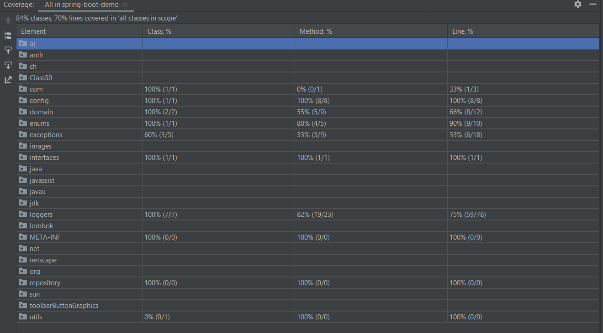

Code Review / Refactoring exercise
----------------------------------

Please review the following code snippet. Assume that all referenced assemblies have been properly included. 

The code is used to log different messages throughout an application. We want the ability to be able to log to a text file, the console and/or the database. Messages can be marked as message, warning or error. We also want the ability to selectively be able to choose what gets logged, such as to be able to log only errors or only errors and warnings. 

If you were to review the following code, what feedback would you give? Please be specific and indicate any errors that would occur as well as other best practices and code refactoring that should be done. 

Rewrite the code based on the feedback you provided in question 1. Please include unit tests on your code.

[JobLogger.java](JobLogger.java)

Feedback
--------

- Violation of SOLID principles, for example:
    - Single responsibility principle (SRP): Only JAVA file that does everything.
    - Open/closed principle (OCP): Its's not designed to be extended.
- Not use of 
    - Interfaces
    - Enums (for message types)
    - StringUtils functions (ex: to validate text length)
    - Exceptions (in case of database connecctions) 
- Complexity method signature (multiple Boolean values and little descriptive, many params in method)
- Complexity of understanding code
- Difficult maintainability
- Easy to inject errors in the code.
- Monolithic functionality: By modifying something, others will probably stop working.
- The names of some variables are not very descriptive.
- Failure to follow principles of object-oriented development, design patterns, clean code.

Rafactoring
-----------

- Implementation of design patterns: Singleton, Composite, Template
- Use JPA for database operations
- Parameterizable configurations (configuration in application.properties file) and open to the extension.
- Implementation of customized and unchecked exceptions.
- More descriptive class, variable and methods names.
- Uncoupled components.
- Exception handling.
- Unit tests and integration tests

Unit tests and integration tests
--------------------------------

Evidence of unit and integration tests:

[Test Results - All_in_spring-boot-demo.html](Test Result)

Coverage of the tests and number of lines tested, using the IDE Coverage tool:

Technical aspects
-----------------

1. Implementation done in Java 11
2. Unit tests with JUnit and Mockito
3. Maven Project
4. Code analysis with Sonarqube
5. Embedded database H2
6. Java Code Coverage Tools.